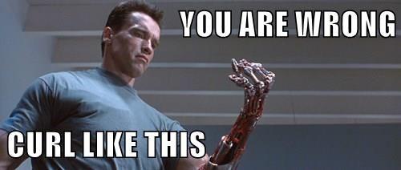

<!-- Run the whole thing first so that we can display accuracy in the overview-->
```{r pre_ingest, ref.label="ingest", include=FALSE, cache=TRUE}
```
```{r pre_select, ref.label="select", include=FALSE, cache=TRUE}
```
```{r pre_anova, ref.label="anova", include=FALSE, cache=TRUE}
```
```{r pre_tree, ref.label="tree", include=FALSE, cache=TRUE}
```
```{r pre_rfor, ref.label="rfor", include=FALSE, cache=TRUE}
```
```{r libs, include=FALSE}
library(scales)
```
<!---------------------------------------------------------------------------->


##Overview

Can wearable sensors and machine learning algorithms help novice weightlifters improve their technique--without human assistance?  To find out, we obtain the Human Activity Recognition weightlifting dataset (see 'Background') and execute basic feature selection and random forest classification.  Using cross-validation, we estimate the in- and out-of-sample performance of the classification model.  We find that without getting too fancy, we can achieve an out-of-sample accuracy of `r percent(cm_rf_oob$overall["Accuracy"])`, and we discuss ways we might get better accuracy in the future. 


##Background

We are given data sets measurements from sensors worn on hands, arms, and belts by subjects performing weightlifting exercises as recorded by Velloso et al. (2013):

> Six young health[y] participants were asked to perform one set of 10 repetitions of the Unilateral Dumbbell Biceps Curl in five different fashions: exactly according to the specification (Class A), throwing the elbows to the front (Class B), lifting the dumbbell only halfway (Class C), lowering the dumbbell only halfway (Class D) and throwing the hips to the front (Class E).[^1]

Our task is to use these measurements to predict not only whether the subject is lifting correctly (i.e., membership in class A) but if not, which category of mistake he/she is committing.  Thus, the target outcome is multinomial (i.e., more than two classes) and unordered.  We assume that the subject is not committing multiple errors simultaneously -- such as throwing the hips to the front while lowering the dumbbell only halfway.

##Data exploration and feature selection

First, we download and read the assignment data files using `getURLContent` (from `RCurl`) and `read.csv`.

```{r ingest, cache=TRUE}
# Data sets are specified in the assignment.
url_dir = "https://d396qusza40orc.cloudfront.net/predmachlearn/"
file_train = "pml-training.csv"
file_test = "pml-testing.csv"

# Get and read the training and testing files.
url_dir <- sub("https","http",url_dir)

library(RCurl, quietly=TRUE)
d_train <- read.csv(text=getURLContent(paste0(url_dir, file_train)))
d_test  <- read.csv(text=getURLContent(paste0(url_dir, file_test )))
```


The first data set, for training, consists of `r nrow(d_train)` observations (in rows) of `r ncol(d_train)` attribute measurements (in columns).  The observations are grouped into time windows, with some measurements being aggregates provided only at the beginning of the time window.  If needed, we could impute these measurements throughout the time window.  However, we observe that in the `r nrow(d_test)` observations in the testing set, which contains no beginnings of time windows, these variables are always `NA`.

Although it is possible that there is some predictive value in whether or not the variables are `NA` -- and that the testing set is skewed towards the former case -- it seems unlikely, so let's see if we can safely eliminate them.  We identify which variables don't appear to be used in the test set and eliminate them from consideration.
 
```{r select, cache=TRUE}
# Attributes that are constant (including NA) are not useful predictors.
unused.attribs <-  function (df) {
  which( sapply( df, function(col) length(unique(col))==1 ) )
}
drop <- unused.attribs(d_test)
d_train <- d_train[,-drop]
```

After dropping `r length(drop)` non-useful attributes from the training set, we now have only `r ncol(d_train)` to worry about, some of which are book-keeping variables (and of course the target).

Next we want to eliminate attributes that are *probably* not useful.  We could attempt more sophisticated feature selection techniques if necessary, including multivariate techniques, but first let's just screen individual attributes for first-order interactions with the target outcome.  We justify this narrow focus because the target classes (errors committed) seem like they would be picked up by individual sensors--i.e., the belt for the hips error, the arms for the elbows error, the wrist for the raising and lowering errors--so we might not have to take second-order effects into account.  Also, we plan on using a classification tree classifier (random forests), which splits on individual explanatory variables.  

We use ANOVA to determine which explanatory variables (all of which are continuous) differ significantly by target outcome class.  For example, we could hypothesize that the total acceleration on the belt is different between performing the exercise correctly and throwing the hips to the front, making that measurement a good *candidate* explanatory variable in the overall model.  To automate this process, we use multiple comparisons.  Note that using the F-statistic for multiple comparisons does not tell us which classes have significantly different measurements--it only tells us whether or not to reject the null hypothesis (i.e., the expected value of the measurement is equal across classes).  We will use a p-value threshold of 0.05, knowing that we will get several false positives but hoping that the classifier will learn to ignore those attributes.  We won't perform a power analysis, but with `nrow(d_train)` observations we ought to be able to pick up reasonably-sized differences in expected explanatory variable value between target classes.

```{r anova, cache=TRUE}
# Except for the target variable and some book-keeping variables,
#  everything else is fair game as an explanatory variable.
elig_exp_vars <- 
  setdiff(names(d_train), c("X","user_name","raw_timestamp_part_1", 
                            "raw_timestamp_part_2", "cvtd_timestamp",
                            "num_window","classe"))

aov_f <- function(formula, data=NULL){
  s <- summary(aov(formula, data)) # runs the F test
  s[[1]][[1,"Pr(>F)"]] # returns the p-value
}
 
pf_elig_exp_vars <- # vector of p-values of F-test of target vs. each exp var
  sapply(elig_exp_vars, function(x) aov_f(get(x) ~ classe, data= d_train) )

# Keep the 'significant' ones.
entering_exp_vars <- elig_exp_vars[pf_elig_exp_vars < 0.05] 
```

Now we are down to `r length(entering_exp_vars)` candidate explanatory variables, each of which appears to have some relationship with the target outcome.  We are not too worried about possible collinearity of the explanatory variables because we understand that each measurement addresses a different aspect of motion (whether from a different sensor or along a different axis, etc.).  So, we will dive into classification algorithms without attempting to orthoganalize the data.  The tree-based approaches we will use are non-parametric and do not require standardized inputs. 

##Classification tree approach

How accurate could we get with just a simple classification tree?  By default, `train` (in `caret`) runs 25 iterations with bootstrap resampling.  We will try cross-validation (by default, ten-fold).  

```{r tree, cache=TRUE}
library(caret)
train_ctrl <- trainControl(method="cv", returnData=FALSE)
t <- train(x=d_train[,entering_exp_vars], y=d_train$classe, method = "rpart",
           trControl=train_ctrl, cp=0.002,maxdepth=8)

library(rpart.plot); library(rattle) #for pretty tree plot
fancyRpartPlot(t$finalModel, sub="",
               main="Classification Tree for Weightlifting Exercise")

cm_ct <- confusionMatrix(predict(t$finalModel, type="class"), d_train$classe)
```

The overall accuracy is clearly not great (and happens to be `r library(scales); percent(cm_ct$overall["Accuracy"])`) --but we can see certain circumstances (the left-most and right-most leaves) under which accuracy is high.  The right-most leaf is obvious: if the belt is rolling a lot, the subject probably needs to ease up on the pelvic thrusts.  Failing that, the left-most leaf suggests that a low forearm pitch is highly predictive of correct execution.  However, these two leaves cover only 16% of observations, and the intermediate leaves are more popular and less accurate.

While it may be possible to improve the performance of a single tree by lowering the complexity threshold and raising the allowable tree length, let's move on to `randomForest`.

##Random forest approach

Perhaps due to the technique's popularity, `rf` is the default method of `train`.  Since it builds 500 trees by default, it can become very computationally expensive when iterated over various tuning parameters, cross-validations, and repetitions.  Cross-validation is probably not necessary to obtain an unbiased estimate of the out-of-bag error,[^2] but it may be useful in feature selection.  Let's see how good we can get with five-fold cross-validation using the initial tuning parameters only, without repetition.  (Of course, Arnold would tell us we could do more reps if we had more discipline--but we are soft and flabby.)  To illustrate that Random Forests' internal error accurately estimates the out-of-bag error, we will also validate against a 30% holdout set, within which `createDataPartition` will try to keep the classes balanced if we specify the target.


```{r rfor, cache=TRUE}
train_ctrl2 <- trainControl(method="cv", number=5, returnData=FALSE)
in_train <- createDataPartition(d_train$classe, p=0.7, list=FALSE) 
rf <- train(x=d_train[in_train,entering_exp_vars], y=d_train$classe[in_train], 
            trControl=train_ctrl2, tuneLength=1)

# Produce confusion natrix for in-sample (i.e., in_train) data
(cm_rf_in <- confusionMatrix(predict(rf$finalModel, type="class"), d_train$classe[in_train]))

# Produce confusion natrix for out-of-sample (-in_train) data
(cm_rf_oob <- confusionMatrix(predict(rf$finalModel, 
                                newdata=d_train[-in_train,entering_exp_vars],
                                type="class"), 
                        d_train$classe[-in_train]))
```


##Out-of-sample error estimate using Random Forest

In estimating classifier performance, we could use either the overall accuracy rate or the Kappa statistic, which accounts for class imbalance.

This classification technique seems quite effective, even without tweaks to the training parameters.

The internal accuracy of the model (calculated over five-fold cross-validation) is `r percent(cm_rf_in$overall["Accuracy"])` overall, or Kappa = `r percent(cm_rf_in$overall["Kappa"])`.

As expected, the internal accuracy is an accurate predictor of the out-of-bag accuracy (i.e., on the 30% holdout never used by *any* of the training folds).  The out-of-bag accuracy is `r percent(cm_rf_oob$overall["Accuracy"])` overall, or Kappa= `r percent(cm_rf_oob$overall["Kappa"])`.

As with the single classification tree, classes A and E seem to be easier to distinguish than B-D.  Reducing confusion between B and C (lifting and lowering only half-way) may require using interaction between variables, since we need to know the angle of arm extension at the time that motion has stopped.  So there's still an opportunity for a sequel.

Hasta la vista, baby!

[^1]: Velloso, E.; Bulling, A.; Gellersen, H.; Ugulino, W.; Fuks, H. 
Qualitative Activity Recognition of Weight Lifting Exercises. 
Proceedings of 4th International Conference in Cooperation with SIGCHI 
(Augmented Human '13). Stuttgart, Germany: ACM SIGCHI, 2013.

[^2]: See [http://www.stat.berkeley.edu/~breiman/RandomForests/cc_home.htm#ooberr](http://www.stat.berkeley.edu/~breiman/RandomForests/cc_home.htm#ooberr)
